

  

  

  

  

  

  

  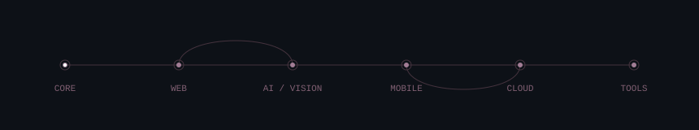

  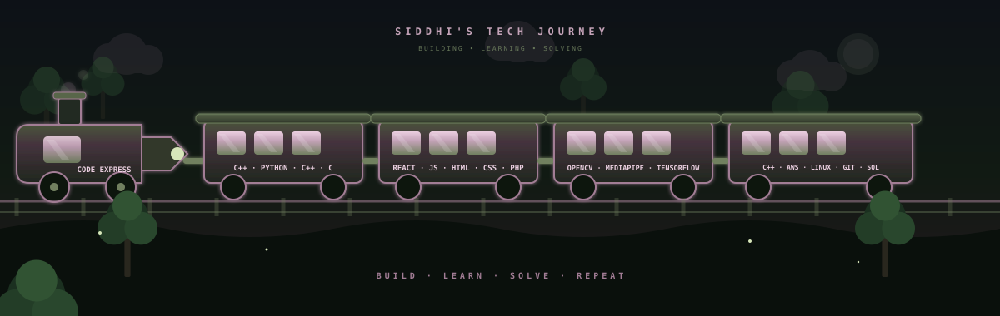

  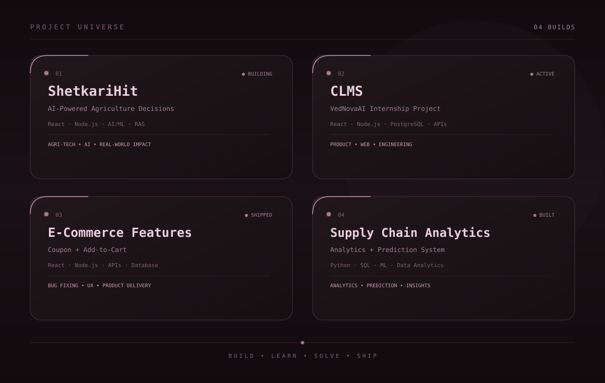

  

  

  

  

  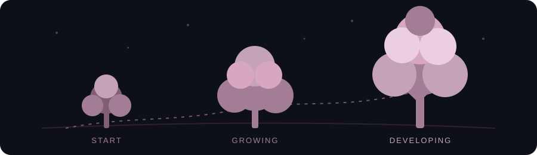

  <picture>
    <source media="(prefers-color-scheme: dark)" srcset="https://raw.githubusercontent.com/Siddhi-Sikchi/Siddhi-Sikchi/output/github-contribution-grid-snake-dark.svg" />
    
  </picture>

  

  
  &nbsp;&nbsp;&nbsp;
  
  &nbsp;&nbsp;&nbsp;
  

  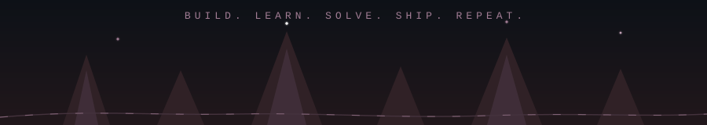

