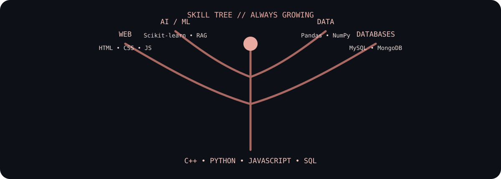
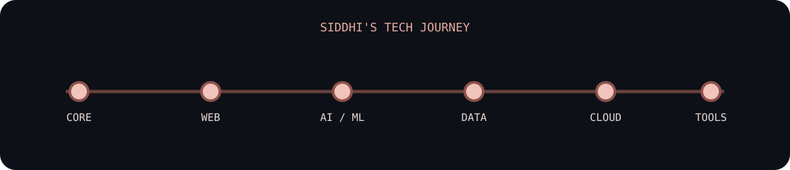

<div align="center">



<br/>


</div>

---

<table>
<tr>
<td width="28%" align="center">


### SIDDHI SIKCHI
`computer engineer`

</td>
<td width="72%">

## `SIDDHI.EXE` // PROFILE

Computer Engineering student at **Vishwakarma Institute of Technology, Pune**, focused on software development and practical problem solving.

Currently working as a **Software Developer Intern at VedNovaAI Technology**, contributing to web features, e-commerce functionality, bug fixing and product development.

> **Build → Break → Learn → Improve → Repeat**

**Education**  
B.Tech — Computer Engineering · VIT Pune · Expected 2028  
**CGPA: 8.85 / 10**

**Achievement**  
97.47 percentile — MHT-CET 2024

</td>
</tr>
</table>

---

## `01` // SKILL TREE



### STACK LOADED

`C++` `Python` `JavaScript` `SQL` `HTML` `CSS`  
`Machine Learning` `Scikit-learn` `Generative AI` `Transformers` `RAG`  
`Pandas` `NumPy` `Matplotlib` `Seaborn`  
`MySQL` `MongoDB`  
`Git` `GitHub` `VS Code` `Jupyter` `Colab` `Postman` `Jira` `Excel`

---

## `02` // TECH JOURNEY



---

## `03` // EXPERIENCE

### `VedNovaAI Technology` · Software Developer Intern
**July 2026 — Present**

- Developed and improved website features based on client requirements.
- Worked on the coupon and discount module for an e-commerce platform.
- Identified and fixed bugs across application features.
- Used Jira for requirements, user flows, bugs and implementation details.
- Collaborated with developers and the product team to deliver assigned work.
- Suggested improvements for functionality and user experience.

---

## `04` // PROJECTS

<table>
<tr>
<td width="50%" valign="top">

### 🌾 ShetkariHit
**AI-Powered Agriculture Decision Platform**

A practical agriculture-focused platform designed to help farmers make better decisions by bringing relevant information and intelligent recommendations into one place.

**Focus:** agriculture • AI/ML • decision support • practical impact

`React` `Python` `AI/ML` `Data`

</td>
<td width="50%" valign="top">

### 📦 E-Commerce & Supply Chain Analytics
**Analytics + Prediction System**

Analyzed **50K+ e-commerce and supply-chain records** using Python and SQL. Performed preprocessing and EDA, then built Decision Tree and Random Forest models for purchasing behavior, delivery risks and sales trends.

**Results:** 98% Decision Tree accuracy · 96% Random Forest accuracy

`Python` `SQL` `Pandas` `NumPy` `Scikit-learn`

</td>
</tr>
</table>

---

## `05` // ACHIEVEMENT SYSTEM

```text
╭──────────────────────────────────────────────────────────────╮
│  01 // PROBLEM SOLVER                                         │
│  97.47 percentile                                            │
│  MHT-CET 2024                                                │
├──────────────────────────────────────────────────────────────┤
│  02 // DATA BUILDER                                           │
│  50K+ records analyzed                                       │
│  98% Decision Tree • 96% Random Forest                       │
├──────────────────────────────────────────────────────────────┤
│  03 // CLOUD EXPLORER                                         │
│  AWS Academy Graduate — Data Engineering                     │
├──────────────────────────────────────────────────────────────┤
│  04 // HACKATHON BUILDER                                      │
│  Women Who Masters Hackathon                                 │
╰──────────────────────────────────────────────────────────────╯
```

---

## `06` // CERTIFICATION LOG

- **Tata Group GenAI Data Analytics Job Simulation** — Forage · June 2026
- **Commonwealth Bank Software Engineering Job Simulation** — Forage · June 2026
- **AWS Academy Graduate — Data Engineering** · May 2026
- **Women Who Masters Hackathon** · July 2026

---

## `07` // GITHUB SIGNALS

<div align="center">


</div>

<div align="center">


</div>

---

## `08` // CONNECT

<div align="center">

**Let's build something useful.**

[](https://github.com/YOUR_GITHUB_USERNAME)
[](https://www.linkedin.com/in/YOUR_LINKEDIN_USERNAME/)
[](mailto:kishusikchi28@gmail.com)
[](https://leetcode.com/)

</div>

---

<div align="center">

```text
SIDDHI@GITHUB:~$ exit

SAVING SESSION............. OK
PROJECTS................... BUILDING
LEARNING................... CONTINUOUS

SESSION COMPLETE ✓

See you in the next commit.
```


</div>
